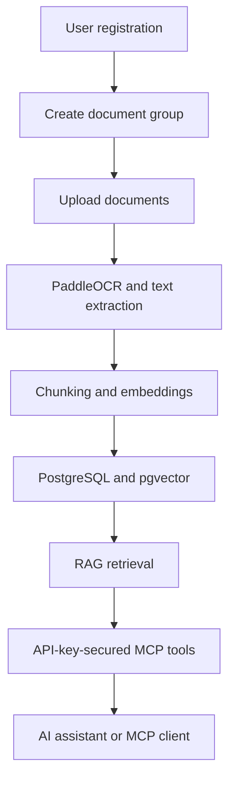

# Open RAG MCP

An open-source SaaS platform for organizing documents, extracting their content, generating vector embeddings, and exposing Retrieval-Augmented Generation (RAG) capabilities through secure MCP tools.

Open RAG MCP is designed to let users connect their private knowledge bases directly to AI assistants and MCP-compatible clients.

> [!IMPORTANT]
> This project is currently in the planning and initial development stage. The repository does not yet contain an application implementation.

## Vision

Organizations and individual users often have valuable information distributed across PDFs, scanned documents, reports, manuals, and internal knowledge files.

Open RAG MCP provides a central platform where users can:

1. Create an account and securely access their workspace.
2. Organize knowledge into document groups.
3. Upload documents to the appropriate group.
4. Extract text from digital and scanned documents.
5. Generate embeddings using open-source models.
6. Search documents using semantic retrieval.
7. Create API keys for external integrations.
8. Connect AI assistants directly through MCP tools.

## Core Features

### User Workspaces

- User registration and authentication
- Isolated user data and document access
- Profile and workspace management
- Secure API-key management

### Document Groups

- Create multiple document groups
- Organize documents by project, department, client, or purpose
- Configure retrieval at document-group level
- Maintain clear separation between knowledge collections

### Document Processing

- Upload PDF and image-based documents
- Extract text using PaddleOCR
- Process scanned and digitally generated documents
- Split extracted content into retrieval-friendly chunks
- Track document processing status and failures

### Open-Source Embeddings

- Generate embeddings using open-source embedding models
- Keep the embedding provider replaceable
- Store and search vectors using PostgreSQL with pgvector
- Support semantic similarity search with metadata filtering

### RAG Retrieval

- Search relevant document chunks using natural-language queries
- Restrict retrieval to selected document groups
- Return source references and document metadata
- Prepare grounded context for AI assistants

### MCP Connectivity

- API-key-secured MCP access
- Connect MCP-compatible AI clients directly to document groups
- Retrieve relevant context without manually copying documents
- Keep MCP tools independent from the frontend application

## Proposed MCP Tools

| Tool | Purpose |
|---|---|
| `list_document_groups` | List document groups available to the authenticated API key |
| `list_documents` | List documents within a selected group |
| `search_documents` | Perform semantic retrieval across permitted document groups |
| `get_document_context` | Retrieve relevant chunks and source metadata |
| `get_document_status` | Check document ingestion and embedding status |

The final MCP tool names and response schemas will be defined during implementation.

## High-Level Workflow



## Planned Technology Stack

| Layer | Technology |
|---|---|
| Frontend | Quasar Framework, Vue.js, TypeScript |
| Backend | Python, FastAPI |
| Database | PostgreSQL |
| Vector storage | pgvector |
| OCR | PaddleOCR |
| Embeddings | Open-source sentence embedding models |
| AI connectivity | Model Context Protocol |
| Authentication | JWT-based user authentication |
| Integration security | Hashed and revocable API keys |

## Proposed Project Structure

The following structure represents the planned application architecture. It has not been generated yet.

```text
open-rag-mcp/
├── backend/
│   ├── app/
│   │   ├── api/
│   │   ├── core/
│   │   ├── models/
│   │   ├── schemas/
│   │   ├── services/
│   │   ├── repositories/
│   │   ├── workers/
│   │   └── mcp/
│   └── tests/
├── frontend/
│   └── src/
├── docs/
├── README.md
└── .gitignore
```

## Planned SaaS Experience

The frontend will be designed as a professional, responsive SaaS application with:

- Product landing page
- Registration and login
- Workspace dashboard
- Document-group management
- Drag-and-drop document uploads
- Document processing status
- Semantic search playground
- API-key management
- MCP connection instructions
- Usage and activity overview
- Responsive light and dark themes

## Frontend Scaffolding

The Quasar frontend must be generated using the official CLI rather than manually creating framework files:

```bash
npm init quasar@latest
```

During setup, the frontend directory should be named `frontend`, and the Quasar CLI with Vite, Vue 3, and TypeScript should be selected.

After scaffolding:

```bash
cd frontend
npm install
npm run dev
```

## Architectural Principles

- **Open-source first:** Prefer locally deployable OCR and embedding models.
- **Tenant isolation:** Every query and document operation must be scoped to its owner.
- **Provider flexibility:** OCR, embeddings, storage, and retrieval implementations should remain replaceable.
- **Secure by default:** Store only hashed API keys and display raw keys once.
- **Source-grounded retrieval:** Retrieval results should include document and chunk references.
- **Asynchronous processing:** OCR and embedding operations should not block API requests.
- **MCP-first integration:** External AI connectivity should be treated as a core capability.
- **Professional SaaS UX:** Complex document processing should remain approachable for non-technical users.

## Proposed Development Phases

### Phase 1 — Foundation

- Backend and frontend scaffolding
- PostgreSQL and pgvector setup
- User registration and authentication
- Document-group management
- Initial SaaS dashboard

### Phase 2 — Document Ingestion

- Document upload and validation
- PaddleOCR integration
- Text extraction and chunking
- Background processing
- Processing-status tracking

### Phase 3 — Retrieval

- Open-source embedding integration
- Vector storage
- Semantic search
- Metadata filtering
- Retrieval source references

### Phase 4 — MCP Integration

- API-key lifecycle management
- MCP server implementation
- Document-group authorization
- Retrieval tools
- MCP client setup documentation

### Phase 5 — Production Readiness

- Automated tests
- Rate limiting
- Audit logs
- Monitoring
- Deployment documentation
- Security review

## Security Considerations

The implementation should include:

- Password hashing
- Hashed API-key storage
- API-key expiration and revocation
- User-level and group-level authorization
- Upload file-type and size validation
- Retrieval filters that enforce tenant ownership
- Protection against unsafe document paths
- Rate limiting for authentication, upload, search, and MCP endpoints
- Audit records for sensitive operations
- No secrets committed to source control

## Project Status

🟡 **Planning**

The initial repository contains project documentation and ignore rules only. Application development has not started.

## Contributing

Contribution guidelines will be added after the initial architecture and MVP scope are finalized.

Ideas, technical discussions, and feature suggestions will be welcome through GitHub Issues.

## License

A suitable open-source license will be selected before the first public release.
