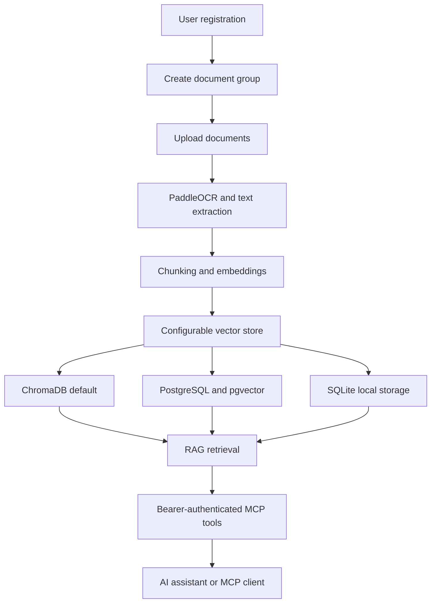

# Open RAG MCP

An open-source SaaS platform for organizing documents, extracting their content, generating vector embeddings, and exposing Retrieval-Augmented Generation (RAG) capabilities through secure MCP tools.

Open RAG MCP is designed to let users connect their private knowledge bases directly to AI assistants and MCP-compatible clients.

> [!IMPORTANT]
> This project is in early development. The repository now includes a FastAPI backend foundation, a Quasar frontend dashboard, document ingestion, semantic retrieval, API-key management, and MCP tool support.

## Vision

Organizations and individual users often have valuable information distributed across PDFs, scanned documents, reports, manuals, and internal knowledge files.

Open RAG MCP provides a central platform where users can:

1. Create an account and securely access their workspace.
2. Organize knowledge into document groups.
3. Upload documents to the appropriate group.
4. Extract text from digital and scanned documents.
5. Generate embeddings using open-source models.
6. Search documents using semantic retrieval.
7. Create document-group-scoped API keys for MCP integrations.
8. Connect AI assistants directly to one selected document group through MCP tools.

## Core Features

### User Workspaces

- User registration and authentication
- Isolated user data and document access
- Profile and workspace management
- Secure API-key management

### Document Groups

- Create multiple document groups
- Organize documents by project, department, client, or purpose
- Configure retrieval at document-group level
- Maintain clear separation between knowledge collections

### Document Processing

- Upload PDF and image-based documents
- Extract text using PaddleOCR
- Process scanned and digitally generated documents
- Split extracted content into retrieval-friendly chunks
- Track document processing status and failures

### Open-Source Embeddings

- Generate embeddings using open-source embedding models
- Keep the embedding provider replaceable
- Store and search vectors using ChromaDB by default
- Keep vector storage selectable through `.env`
- Support PostgreSQL with pgvector and SQLite-backed local storage as alternate providers
- Support semantic similarity search with metadata filtering

### RAG Retrieval

- Search relevant document chunks using natural-language queries
- Restrict retrieval to selected document groups
- Return source references and document metadata
- Prepare grounded context for AI assistants

### MCP Connectivity

- Document-group-scoped, API-key-secured MCP access
- MCP bearer-token authentication, so API keys are not tool arguments
- Hashed, revocable API keys for external integrations
- Connect MCP-compatible AI clients directly to a selected document group
- Retrieve relevant context without manually copying documents
- Keep MCP tools independent from the frontend application

## Proposed MCP Tools

| Tool | Purpose |
|---|---|
| `list_document_groups` | List the document group assigned to the authenticated bearer token |
| `list_documents` | List documents within the bearer token's assigned group |
| `search_documents` | Perform semantic retrieval only inside the bearer token's assigned group |
| `get_document_context` | Retrieve relevant chunks and source metadata |
| `get_document_status` | Check document ingestion and embedding status |

The final MCP tool names and response schemas will be defined during implementation.

## High-Level Workflow



## Planned Technology Stack

| Layer | Technology |
|---|---|
| Frontend | Quasar Framework, Vue.js, TypeScript |
| Backend | Python, FastAPI |
| Primary application database | Configurable through `.env`; SQLite for local development, PostgreSQL for production |
| Vector storage | ChromaDB by default; PostgreSQL/pgvector and SQLite-backed local storage as selectable alternatives |
| OCR | PaddleOCR |
| Embeddings | Open-source sentence embedding models |
| AI connectivity | Model Context Protocol |
| Authentication | JWT-based user authentication |
| Integration security | Hashed and revocable API keys |

## Project Structure

The application uses a modular backend and a Quasar/Vue frontend.

```text
open-rag-mcp/
├── backend/
│   ├── app/
│   │   ├── api/
│   │   ├── core/
│   │   ├── models/
│   │   ├── schemas/
│   │   ├── services/
│   │   ├── repositories/
│   │   ├── workers/
│   │   └── mcp/
│   └── tests/
├── frontend/
│   └── src/
├── docs/
├── README.md
└── .gitignore
```

## SaaS Experience

The frontend currently provides:

- Registration and login
- Workspace dashboard
- Document-group management
- Text document ingestion
- File uploads
- Processing status tracking
- Semantic search playground
- API-key management

## Frontend Scaffolding

The Quasar frontend must be generated using the official CLI rather than manually creating framework files:

```bash
npm init quasar@latest
```

During setup, the frontend directory should be named `frontend`, and the Quasar CLI with Vite, Vue 3, and TypeScript should be selected.

After scaffolding or dependency installation:

```bash
cd frontend
npm install
npm run dev
```

## Running Locally

After installing backend dependencies into `.venv`, start the API from the repository root:

```bash
python -m run
```

Start the frontend from a second terminal:

```bash
cd frontend
npm run dev
```

The frontend defaults to `http://localhost:9000` and calls the API at `http://127.0.0.1:8000`. Override that with `frontend/.env`:

```bash
VITE_API_BASE_URL=http://127.0.0.1:8000
```

When opening the frontend by server IP or domain, use that same externally reachable API origin and add the frontend origin to backend CORS:

```bash
VITE_API_BASE_URL=http://YOUR_SERVER_IP:8000
CORS_ORIGINS=http://YOUR_SERVER_IP:9000
```

Optional modes:

```bash
python -m run api --host 127.0.0.1 --port 8000 --reload
python -m run api --no-migrate
python -m run api --no-reload
python -m run mcp
```

The API runner applies Alembic migrations before startup by default. Use `--no-migrate` only when the database has already been migrated.

The normal API process also exposes the hosted streamable HTTP MCP endpoint at `/mcp`, so end users should configure their AI platform with the deployed MCP URL and the document-group-scoped API key as a bearer token instead of running Python commands.

## Environment Configuration

Runtime storage choices should be configured through `.env` so the application can start with ChromaDB now and later switch to PostgreSQL/pgvector or SQLite without changing code.

Copy `.env.example` to `.env` for local development.

```bash
cp .env.example .env
```

Planned storage settings:

| Variable | Default | Purpose |
|---|---|---|
| `SECRET_KEY` | `change-this-development-secret` | Signs local JWT access tokens; must be changed outside development |
| `ACCESS_TOKEN_EXPIRE_MINUTES` | `60` | Lifetime for bearer access tokens |
| `AUTO_CREATE_TABLES` | `false` | Legacy development fallback for creating tables without migrations |
| `CORS_ORIGINS` | Quasar dev origins | Comma-separated browser origins allowed to call the API |
| `CORS_ALLOW_CREDENTIALS` | `true` | Allows browser clients to send credentials and authorization headers |
| `CORS_ALLOW_METHODS` | API methods | Comma-separated HTTP methods allowed in CORS preflight |
| `CORS_ALLOW_HEADERS` | API and MCP headers | Comma-separated request headers accepted in CORS preflight |
| `CORS_EXPOSE_HEADERS` | MCP session/auth headers | Comma-separated response headers browser clients may read |
| `CORS_MAX_AGE` | `600` | Browser preflight cache lifetime in seconds |
| `MCP_ISSUER_URL` | `http://127.0.0.1:8000` | Issuer URL advertised for MCP bearer-token authentication |
| `MCP_RESOURCE_SERVER_URL` | `http://127.0.0.1:8000/mcp` | Public MCP resource URL used by MCP auth metadata |
| `MCP_ENABLE_DNS_REBINDING_PROTECTION` | `true` | Enables MCP Host/Origin validation |
| `MCP_ALLOWED_HOSTS` | `127.0.0.1:8000,localhost:8000` | Comma-separated Host headers allowed to call MCP, for example a Cloudflare Tunnel host |
| `MCP_ALLOWED_ORIGINS` | empty | Optional comma-separated browser Origin headers allowed to call MCP |
| `APP_DATABASE_PROVIDER` | `sqlite` | Selects the relational application database provider: `sqlite` or `postgresql` |
| `DATABASE_URL` | `sqlite:///./data/open_rag_mcp.db` | SQLAlchemy-style database connection URL |
| `VECTOR_STORE_PROVIDER` | `chroma` | Selects vector storage: `chroma`, `postgresql`, or `sqlite` |
| `CHROMA_PERSIST_DIRECTORY` | `./data/chroma` | Local persistence directory for ChromaDB, resolved relative to the repository root |
| `CHROMA_COLLECTION_NAME` | `open_rag_documents` | Default ChromaDB collection for document chunks |
| `PGVECTOR_DATABASE_URL` | empty | PostgreSQL connection URL used when `VECTOR_STORE_PROVIDER=postgresql` |
| `SQLITE_VECTOR_DATABASE_URL` | `sqlite:///./data/vectors.db` | SQLite-backed vector storage URL used when `VECTOR_STORE_PROVIDER=sqlite`; relative paths resolve from the repository root |
| `EMBEDDING_DIMENSION` | `384` | Dimension used by the local development embedding service |
| `EMBEDDING_PROVIDER` | `hashing` | Embedding provider: `hashing` or `sentence_transformers` |
| `EMBEDDING_MODEL_NAME` | `BAAI/bge-small-en-v1.5` | Sentence Transformers model used when `EMBEDDING_PROVIDER=sentence_transformers` |
| `EMBEDDING_QUERY_INSTRUCTION` | `Represent this sentence for searching relevant passages: ` | Query prefix used by BGE-style retrieval models |
| `EMBEDDING_DEVICE` | empty | Optional Sentence Transformers device, such as `cpu` or `cuda` |
| `EMBEDDING_BATCH_SIZE` | `32` | Batch size passed to Sentence Transformers encoding |
| `CHUNK_SIZE` | `1200` | Approximate character size for indexed text chunks |
| `CHUNK_OVERLAP` | `150` | Character overlap between adjacent chunks |
| `UPLOAD_DIRECTORY` | `./data/uploads` | Local storage directory for uploaded source files |
| `MAX_UPLOAD_SIZE_MB` | `25` | Maximum accepted upload size in megabytes |
| `OCR_PROVIDER` | `disabled` | OCR backend for images and scanned PDFs: `disabled` or `paddle` |
| `OCR_LANGUAGE` | `en` | Language code passed to PaddleOCR when OCR is enabled |
| `OCR_PDF_DPI` | `200` | Render DPI for scanned PDF pages before OCR |

## Architectural Principles

- **Open-source first:** Prefer locally deployable OCR and embedding models.
- **Tenant isolation:** Every query and document operation must be scoped to its owner.
- **Provider flexibility:** OCR, embeddings, storage, and retrieval implementations should remain replaceable.
- **Secure by default:** Store only hashed API keys and display raw keys once.
- **Source-grounded retrieval:** Retrieval results should include document and chunk references.
- **Asynchronous processing:** OCR and embedding operations should not block API requests.
- **MCP-first integration:** External AI connectivity should be treated as a core capability.
- **Professional SaaS UX:** Complex document processing should remain approachable for non-technical users.

## Proposed Development Phases

### Phase 1 — Foundation

- Backend and frontend scaffolding
- ChromaDB setup as the default vector store
- `.env`-driven storage provider selection for ChromaDB, PostgreSQL/pgvector, and SQLite
- User registration and authentication
- Document-group management
- Initial SaaS dashboard

### Phase 2 — Document Ingestion

- Document upload and validation
- PaddleOCR integration
- Text extraction and chunking
- Background processing
- Processing-status tracking

### Phase 3 — Retrieval

- Open-source embedding integration
- Configurable vector storage
- Semantic search
- Metadata filtering
- Retrieval source references

### Phase 4 — MCP Integration

- API-key lifecycle management
- MCP server implementation
- Document-group authorization
- Retrieval tools
- MCP client setup documentation

### Phase 5 — Production Readiness

- Automated tests
- Rate limiting
- Audit logs
- Monitoring
- Deployment documentation
- Security review

## Security Considerations

The implementation should include:

- Password hashing
- Hashed API-key storage
- API-key expiration and revocation
- MCP API keys passed only through bearer-token auth, never tool arguments
- User-level and group-level authorization
- Upload file-type and size validation
- Retrieval filters that enforce tenant ownership
- Protection against unsafe document paths
- Rate limiting for authentication, upload, search, and MCP endpoints
- Audit records for sensitive operations
- No secrets committed to source control

## Project Status

🟡 **Early MVP development**

The core local MVP is available: FastAPI API, Quasar frontend, `.env` provider selection, ChromaDB default vector storage, SQLite local app database, user auth, document groups, uploads, queued processing, semantic search, API keys, and MCP tools.

## Contributing

Contribution guidelines will be added after the initial architecture and MVP scope are finalized.

Ideas, technical discussions, and feature suggestions will be welcome through GitHub Issues.

## License

A suitable open-source license will be selected before the first public release.
