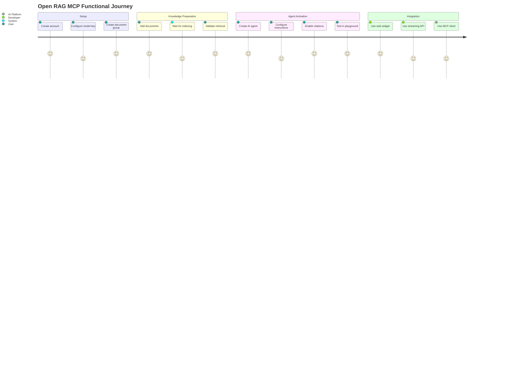
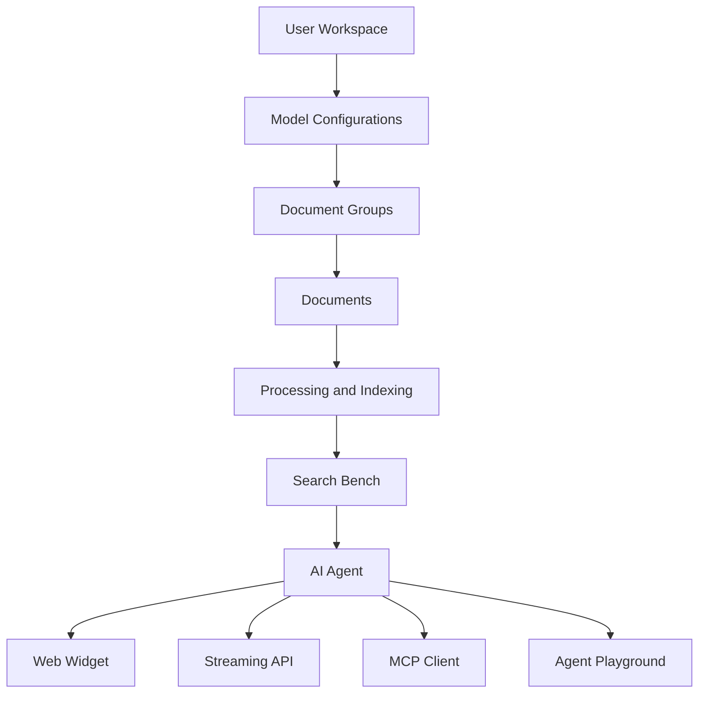

# Product Overview

Open RAG MCP is a private knowledge platform that lets a user upload documents, organize them into document groups, search them using natural language, and expose the same knowledge to AI agents, web applications, streaming APIs, and MCP-compatible AI platforms.

The product is designed around one core use case:

> A user prepares a private knowledge base, creates secure access for that knowledge base, and allows an AI experience to answer questions using only the relevant documents.

## Product Positioning

Open RAG MCP sits between private documents and AI applications. It helps users avoid manually copying files into AI tools while still giving AI systems reliable access to the right information.

The platform is useful for:

| User Type | Functional Need |
|---|---|
| SaaS builders | Add a document-aware AI assistant to a product |
| Portfolio builders | Demonstrate end-to-end RAG, MCP, and agent workflows |
| Teams | Keep project, client, or department knowledge separated |
| Developers | Connect the same document group through web, API, or MCP |
| Knowledge owners | Control which group of documents an external assistant can access |

## Functional Value Proposition

Open RAG MCP provides:

- A workspace for managing private knowledge.
- Document groups for separating knowledge by client, topic, project, or business area.
- Document upload and text entry workflows.
- Model configuration before knowledge ingestion.
- Search validation before exposing knowledge to agents.
- AI agents that are bound to selected document groups.
- Citations so users can verify the source behind an AI answer.
- Integration options for web widgets, server-side streaming, and MCP clients.
- API keys scoped to document groups so integrations cannot access unrelated knowledge.

## End-to-End User Journey

## Functional Architecture

## Key Product Principles

| Principle | Functional Meaning |
|---|---|
| Configure first | Users set up model configs before creating document groups |
| Group-scoped knowledge | Documents, keys, agents, and search are tied to selected groups |
| BYOK | Users bring their own provider keys for model usage |
| Secure access | Raw private keys and API keys are never shown repeatedly |
| Grounded answers | AI answers can include citations from retrieved documents |
| Simple screen flow | The app follows a clear setup, ingest, test, connect sequence |
| Multi-channel use | The same prepared knowledge can power UI, API, and MCP integrations |

## Product Screens

| Screen | Functional Role |
|---|---|
| Dashboard | Shows workspace analytics and processing status |
| LLM Config | Creates reusable embedding and chat model configurations |
| Document Groups | Creates knowledge collections and maps embedding configs |
| Documents | Adds, lists, processes, and deletes documents for a selected group |
| Search Bench | Tests retrieval quality before using agents |
| AI Agent | Creates group-bound agents and exposes integration options |
| Agent Playground | Tests agents through a controlled chat interface |

