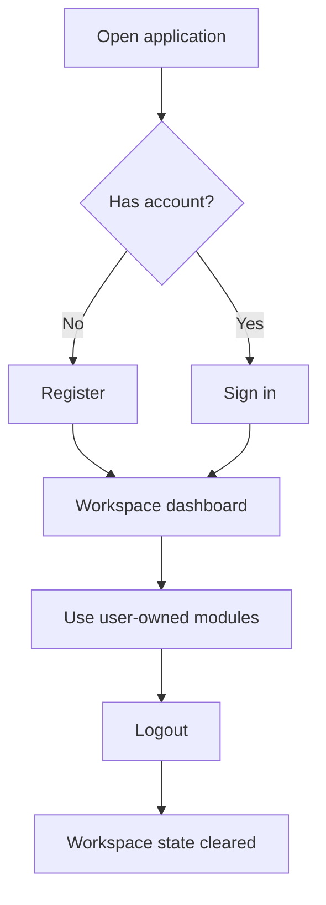

# User Workspace and Access

The workspace is the user's private operating area in Open RAG MCP. Every document group, document, model configuration, API key, AI agent, and conversation belongs to the logged-in user.

## Functional Goals

- Let users register and sign in.
- Keep each user's data isolated.
- Reset visible workspace data when the logged-in user changes.
- Give each user a single place to manage private documents, agents, and integrations.

## Access Flow

## Workspace Ownership

Each user receives a private workspace. The product experience assumes that users may log out and another user may log in on the same browser. When this happens, the visible records must change to match the current account.

| Workspace Item | User Scope |
|---|---|
| LLM configs | Visible only to owner |
| Document groups | Visible only to owner |
| Documents | Visible only through owner groups |
| Search results | Based only on selected owner group |
| API keys | Visible only for owner groups |
| AI agents | Visible only for owner groups |
| Playground sessions | Visible only for owner agents |

## Functional Screen Behavior

When a user logs in:

1. The app loads the user's document groups.
2. The first available group is selected automatically.
3. Group-scoped data is loaded for that selected group.
4. Menus become available according to the product flow.

When a user logs out:

1. Workspace records are cleared from the screen.
2. Selected group state is cleared.
3. Search results, documents, keys, agents, and model lists are removed from the active UI state.
4. The login screen becomes the primary experience.

## Portfolio Highlight

This workspace design demonstrates a tenant-aware SaaS flow where every feature respects account ownership and prevents cross-user confusion in dropdowns, tables, and agent selections.

