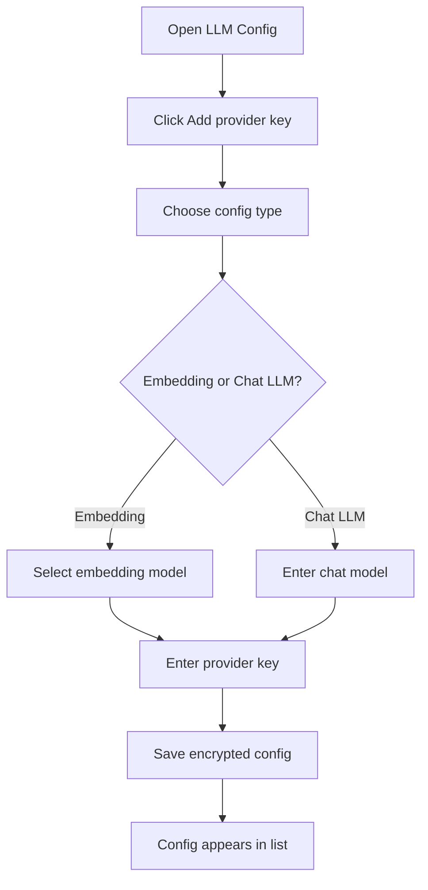
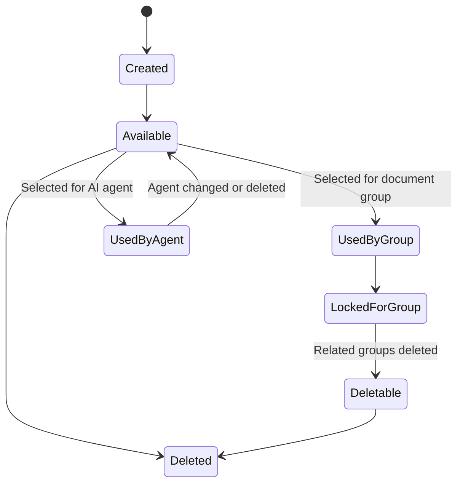

# LLM Config

LLM Config is the first setup screen in the product flow. Users create model configurations before creating document groups or AI agents.

The current functional scope supports Google Gemini provider configuration for:

- Embedding model configs.
- Chat LLM configs.

## Functional Purpose

LLM Config lets users bring their own provider key and store it as a reusable model configuration. The user can create different configurations for different purposes, then select those configurations while creating document groups or AI agents.

## Config Types

| Config Type | Used For | Functional Rule |
|---|---|---|
| Embedding | Document indexing and search | Selected during document group creation |
| Chat LLM | AI agent responses | Selected during AI agent creation and editable later on the agent |

## User Flow

## Functional Rules

- Config names are unique within a user's workspace.
- Provider keys are stored securely and are not shown back to the user.
- Embedding configs can be mapped to document groups.
- Once an embedding config is mapped to a document group, that group continues using it for document embedding and search.
- Configs already used by document groups cannot be deleted until those groups are removed.
- A default internal config remains available for local or fallback use.
- Chat LLM configs can be changed on an AI agent so the agent can switch to another available chat model.

## Supported Provider Experience

| Provider | Embedding Models Available in UI | Functional Usage |
|---|---|---|
| Google Gemini | Gemini Embedding 2, Gemini Embedding 001 | Used to create document embeddings |
| Google Gemini | User-entered chat model | Used by AI agents to answer questions |

## Model Configuration Lifecycle

## Functional Benefits

- Users control which provider key powers their documents and agents.
- Model setup is separated from document ingestion.
- Groups preserve embedding consistency over time.
- Future support for more providers can follow the same user-facing pattern.

