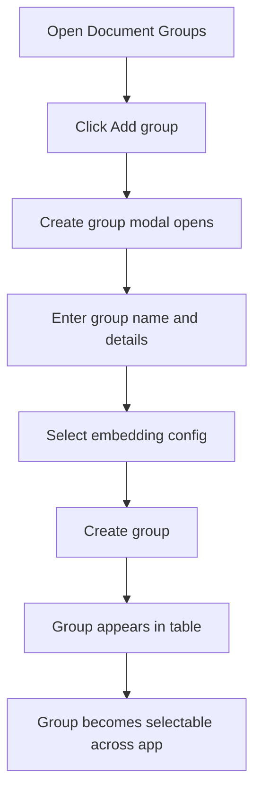
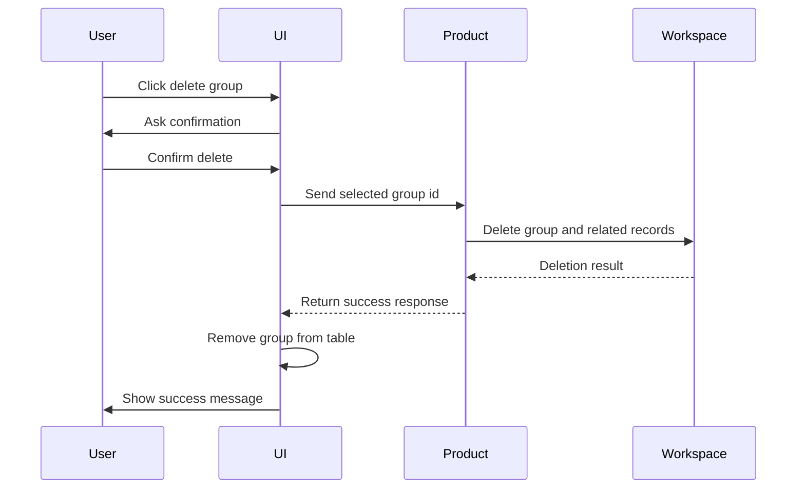

# Document Groups

Document Groups are the main knowledge containers in Open RAG MCP. A group represents one private knowledge base, such as a client project, product manual, policy collection, support knowledge base, or department repository.

## Functional Purpose

Document Groups let users keep different knowledge collections separated. Every document, search, API key, AI agent, and MCP connection is scoped to a selected group.

## Group Creation Flow

## Group Profile

A document group includes:

| Field | Functional Meaning |
|---|---|
| Group name | Human-readable knowledge base name |
| Description | Business context for the knowledge base |
| Embedding config | Model configuration used for documents in the group |
| Created date | When the group was added |
| Document count | Number of documents in the group |
| Processing status | Whether documents are ready, pending, or failed |

## Group Selection

The selected group controls the active context for:

- Documents list.
- Document upload.
- Search Bench.
- API key list.
- AI agent list.
- Agent Playground agent selection.
- MCP and streaming API access.

## Group Deletion Flow

## Functional Rules

- A group belongs to one user.
- A group uses one embedding configuration.
- The embedding configuration for a group is fixed after creation to keep embeddings consistent.
- API keys created for one group cannot access another group.
- Agents created for one group retrieve knowledge only from that group.
- Deleting a group removes the group from the visible table after backend confirmation.

## Portfolio Highlight

Document Groups demonstrate a clear multi-knowledge-base model. This is important for real business usage because a single user may manage multiple private knowledge collections with different access boundaries.

