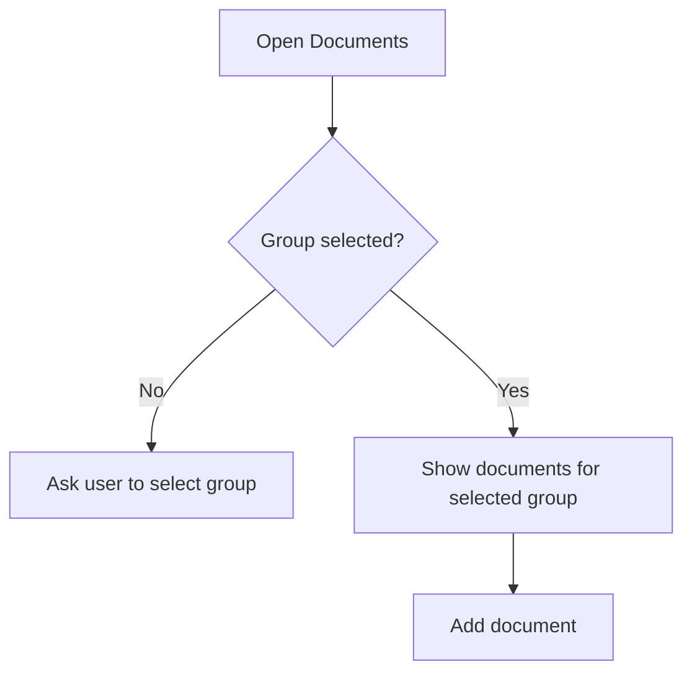
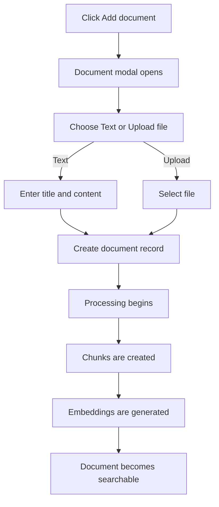
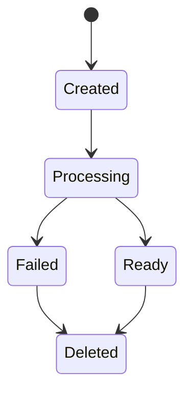
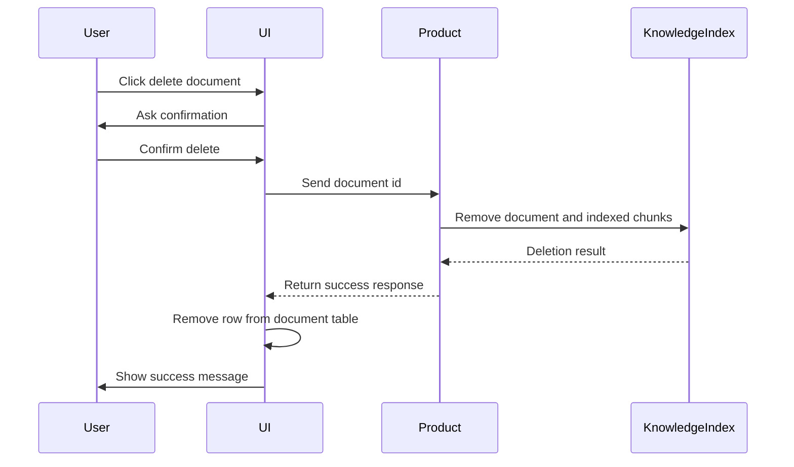

# Documents

The Documents screen is where users add and manage content inside a selected document group.

## Functional Purpose

Documents are the source material used by search, AI agents, web widgets, streaming APIs, and MCP integrations. Users can add documents as uploaded files or pasted text.

## Required Group Selection

The Documents screen is always group-scoped. A user must select a document group before adding or viewing documents.

## Add Document Flow

When the user clicks Add document, a modal opens. The first choice is the document input type.

| Input Type | User Provides | Functional Result |
|---|---|---|
| Text | Title and pasted content | Content is saved and indexed |
| Upload file | File and metadata | File is processed, extracted, and indexed |

## Document Table

The document table shows records for the selected group and supports pagination.

| Column Type | Functional Use |
|---|---|
| Document title | Identifies source material |
| Source type | Shows whether it came from text or upload |
| Status | Shows processing state |
| Created date | Helps track recent additions |
| Actions | Delete or manage the document |

## Processing States

## Delete Document Flow

Deleting a document means deleting the document and its retrieval content. Functionally, the document is removed from the master record and the associated embedding records are removed so the deleted document no longer appears in search, agent answers, web widget responses, streaming API responses, or MCP retrieval.

## Functional Rules

- Documents belong to one group.
- Documents inherit the group's embedding configuration.
- Documents are searchable only after processing completes.
- Deleted documents must not remain visible in the UI table.
- Deleted documents must not be used by retrieval or agents.
- Group selection controls which document records are visible.

## Portfolio Highlight

The Documents module demonstrates the full knowledge preparation cycle: create source material, process it, make it searchable, and safely remove it when it is no longer valid.

