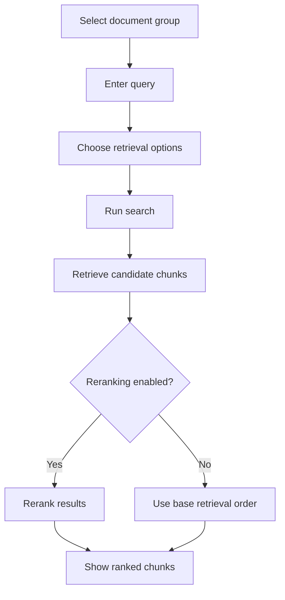
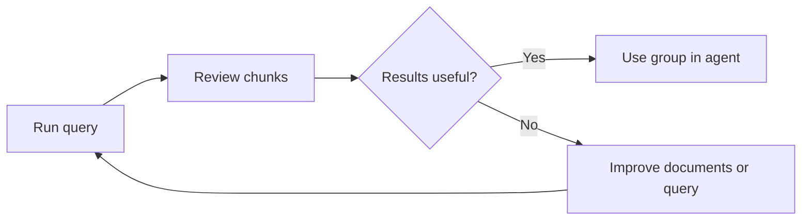

# Search Bench

Search Bench is the retrieval testing area. It lets users validate whether a document group returns useful chunks before connecting that group to an AI agent or external application.

## Functional Purpose

Search Bench answers the question:

> If a user asks this query, which document chunks will the system retrieve from the selected group?

This gives users a way to tune confidence before exposing the knowledge base through AI experiences.

## Search Flow

## Search Controls

| Control | Functional Meaning |
|---|---|
| Document group | Limits search to one knowledge base |
| Query | Natural-language search request |
| Result count | Controls how many chunks are returned |
| Reranking | Improves final order of retrieved chunks |
| Diversity options | Helps avoid returning near-duplicate chunks |

## Result Review

Search results show the user:

- Relevant chunk text.
- Source document information.
- Similarity or relevance score.
- Metadata that helps identify where the chunk came from.

## Retrieval Quality Loop

## Functional Rules

- Search is always limited to the selected document group.
- Turning reranking off should not break retrieval.
- Results should still be returned when optional ranking enhancements are disabled.
- Deleted documents must not appear in results.
- Search helps validate data before creating user-facing agents.

## Portfolio Highlight

Search Bench shows that the product treats retrieval quality as a first-class workflow, not just a hidden backend feature. It gives users a transparent way to inspect the grounding layer behind AI answers.

