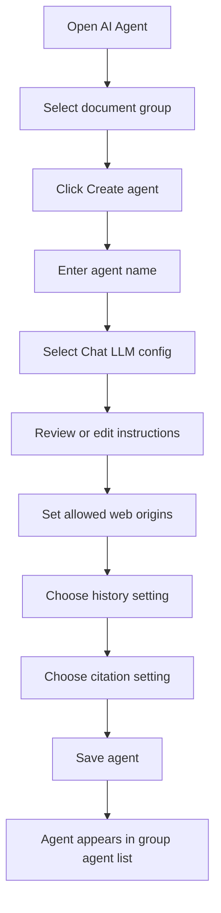
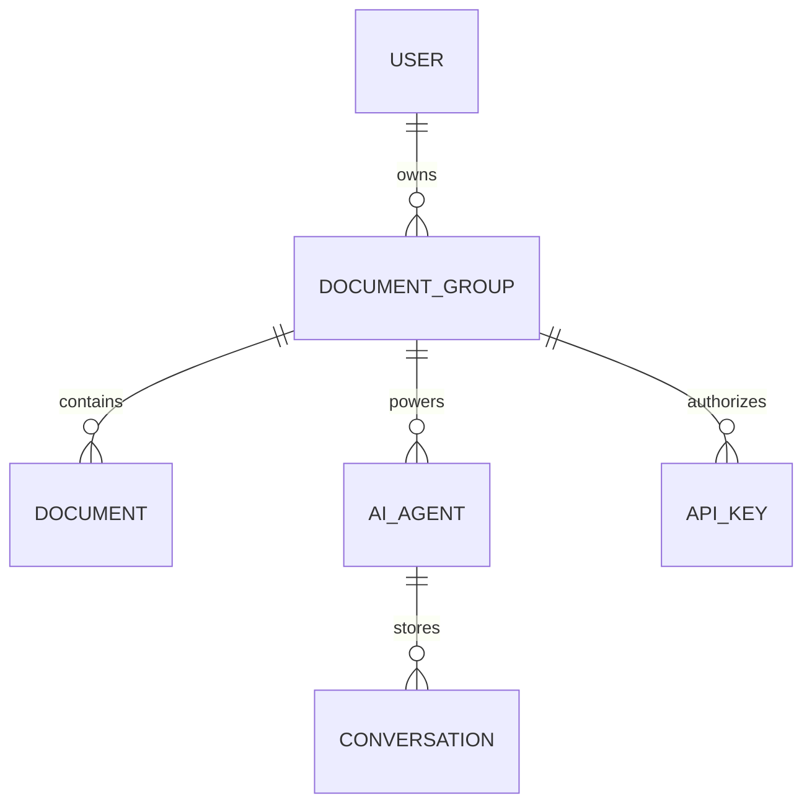
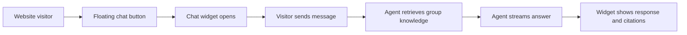
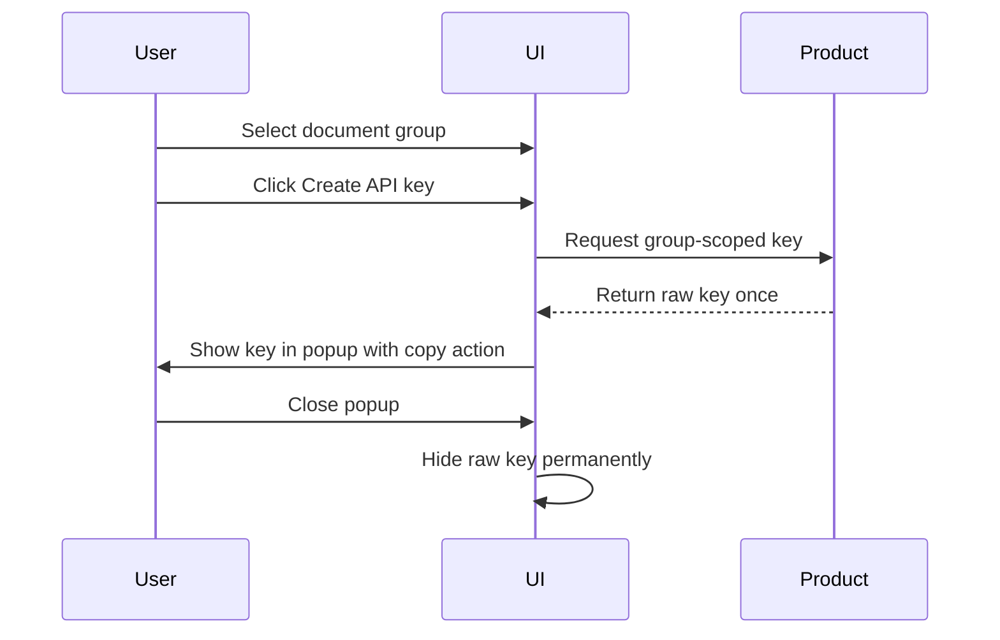

# AI Agent and Integrations

The AI Agent screen lets users create group-specific agents and connect those agents to external experiences.

The former MCP-only connection concept has evolved into a broader AI Agent setup area with three integration modes:

- Web SDK.
- Streaming API.
- MCP.

## Functional Purpose

An AI agent is a configured conversational assistant attached to one document group. It can answer user questions by retrieving relevant knowledge from that group and using a selected Chat LLM config to generate the response.

## Agent Creation Flow

## Agent Settings

| Setting | Functional Meaning |
|---|---|
| Agent name | User-facing label for the assistant |
| Chat LLM config | Model config used to generate responses |
| Instructions | Behavior rules for the agent |
| Allowed origins | Web domains allowed to use the public widget |
| Conversation history | Whether the agent remembers previous turns |
| Citation display | Whether answers include source citations |
| Active status | Whether the agent is available for use |

## Agent and Group Relationship

## Integration Options

| Integration | User Scenario | Key Behavior |
|---|---|---|
| Web SDK | Website owner wants a floating chat widget | Uses public key from client page |
| Streaming API | Developer builds their own UI | Uses private group API key on server side |
| MCP | User connects an AI platform to group retrieval | Uses private group API key as bearer auth |

## Web SDK Functional Experience

The web SDK is designed for website embedding. A developer includes the SDK script, initializes it with a public agent key, and the product displays a floating chat button at the bottom-right of the page.

Functional expectations:

- The website only uses the public key.
- Private API keys remain inside Open RAG MCP.
- The chat UI appears as an embedded floating assistant.
- Markdown responses are displayed cleanly.
- Citations are shown only when the agent setting allows them.

## Streaming API Functional Experience

The streaming API is intended for developers who want to own the frontend UI but use Open RAG MCP as the agent backend.

Functional expectations:

- The developer sends user messages from their own backend.
- The request uses a private group API key.
- Responses stream back as the agent thinks and answers.
- The developer can render messages, citations, and progress in their own UI.

## MCP Functional Experience

MCP integration lets a compatible AI platform request relevant knowledge from a document group.

Functional expectations:

- MCP access is authenticated through headers.
- The API key is scoped to one document group.
- The key is not exposed as a tool argument to the LLM.
- The external AI platform can retrieve relevant chunks from the assigned group only.

## Citation Behavior

When citations are enabled:

- Agent answers can include inline citation markers.
- Source details can be expanded in the UI.
- Users can verify which document supported the answer.

When citations are disabled:

- Inline citation markers are not required.
- Source sections are hidden.
- The agent still uses the group documents for retrieval.

## API Key Creation Flow

## Functional Rules

- Agents are created for one document group.
- Agents retrieve only from their assigned group.
- Agent Chat LLM config can be changed to another available Chat LLM config.
- Private API keys are displayed only once.
- Public keys are used for web embedding.
- Private keys are used for server-side and MCP access.
- Citations follow the agent-level citation setting.

## Portfolio Highlight

This module demonstrates a complete AI product integration layer: user-managed agents, private group knowledge, secure key handling, embeddable chat UI, API streaming, and MCP-based retrieval.

