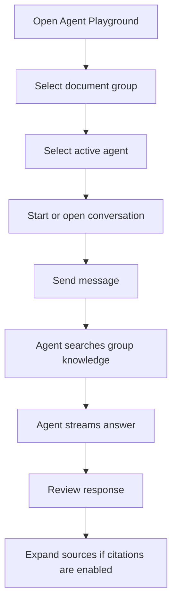
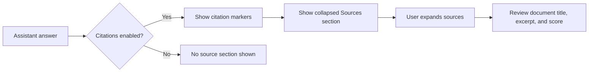

# Agent Playground

Agent Playground is the in-app testing environment for AI agents. It lets users chat with their configured agents before exposing them to users or external systems.

## Functional Purpose

The playground helps users validate:

- Whether the agent follows its instructions.
- Whether retrieval finds the right group documents.
- Whether citations appear correctly.
- Whether conversation history behaves as expected.
- Whether streamed responses feel useful and complete.

## Playground Flow

## Conversation Management

| Capability | Functional Meaning |
|---|---|
| New conversation | Starts a fresh session |
| Saved sessions | Shows previous conversations for the selected agent |
| Rename session | Gives a conversation a meaningful label |
| Delete session | Removes saved history |
| Refresh sessions | Reloads the conversation list |

## Chat Experience

The chat area supports:

- User messages.
- Assistant messages.
- Markdown-formatted answers.
- Streamed response updates.
- Tool activity status, such as document search.
- Latency and token summary where available.
- Collapsible sources for cited answers.

## Citation Experience

## History Behavior

If conversation history is enabled for the agent:

- Conversations can be reopened.
- Previous messages remain associated with the selected agent.
- The session list displays saved conversations.

If conversation history is disabled:

- The chat still works.
- Messages are available only during the current screen interaction.
- The UI warns the user that history is not saved.

## Functional Rules

- Playground agents are filtered by selected document group.
- Only active agents are available for testing.
- Switching the selected agent starts a fresh context.
- Session history belongs to the selected agent.
- Search activity is visible during agent response generation.
- Citations are displayed according to the agent setting.

## Portfolio Highlight

Agent Playground demonstrates a professional AI product workflow: create an agent, test it, inspect its knowledge usage, evaluate source grounding, and then publish the same agent through web, API, or MCP.

