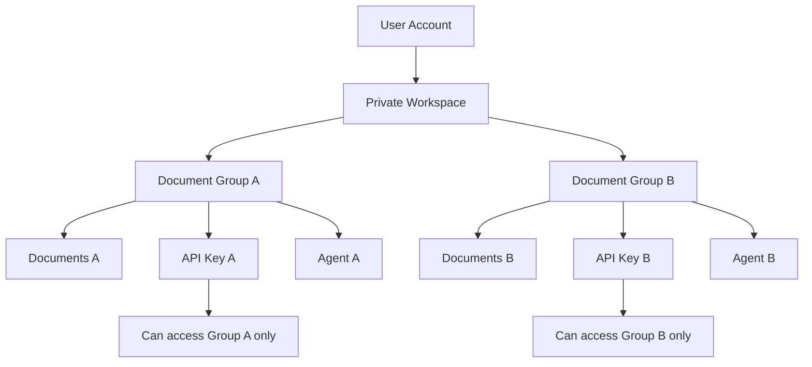
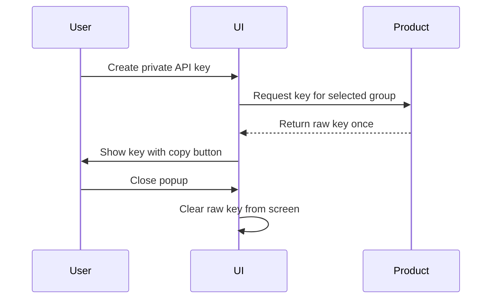

# Security and Governance

Open RAG MCP is built around private knowledge access. The functional security model focuses on controlling who can see documents, which group an integration can access, and how secrets are handled in the user experience.

## Functional Security Goals

- Keep user workspaces isolated.
- Scope documents and agents to document groups.
- Avoid exposing private API keys to browser clients or LLM tool arguments.
- Show raw integration keys only once.
- Make deleted documents unavailable to future retrieval.
- Give users clear control over citations and source visibility.

## Access Boundary Model

## API Key Governance

API keys are created for document groups. A key created for one group authorizes access only to that group.

| Key Type | Used By | Exposure Rule |
|---|---|---|
| Public agent key | Browser web widget | Safe to place in client page |
| Private group API key | Streaming API and MCP | Must be kept server-side or in secure platform settings |

## One-Time Secret Display

Functional benefits:

- Users are warned that the key appears only once.
- The UI encourages immediate copying.
- Closing the popup removes the visible raw key.
- Later lists show only safe key hints and metadata.

## Document Deletion Governance

When a document is deleted, the product treats it as removed from the knowledge base. It should no longer be retrievable by:

- Search Bench.
- AI Agent.
- Web SDK.
- Streaming API.
- MCP.

## Citation Governance

Citations help users trust an answer. They can be enabled or disabled at the agent level.

| Citation Setting | Functional Behavior |
|---|---|
| Enabled | Answers can show inline markers and expandable sources |
| Disabled | Sources are hidden from the chat UI |

## Data Visibility Rules

| Feature | Visibility Rule |
|---|---|
| Document groups | Current user only |
| Documents | Current user and selected group only |
| Search results | Current selected group only |
| API keys | Current user and selected group only |
| Agents | Current user and selected group only |
| Playground sessions | Selected agent only |

## Portfolio Highlight

This governance model demonstrates the most important product quality for private AI systems: users can connect documents to AI without turning every document into globally available context.

