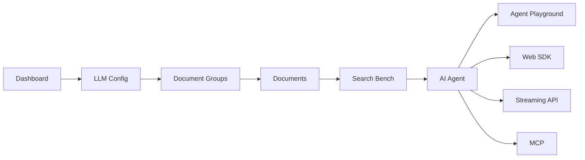

# Open RAG MCP Functional Documentation

This documentation describes the product capabilities of Open RAG MCP from a functional and user-facing perspective. It is written for portfolio review, product walkthroughs, business stakeholders, and users who need to understand what the platform does without reading implementation details.

## Documentation Index

| Area | Document | What It Explains |
|---|---|---|
| Product story | [Product Overview](./01-product-overview.md) | Product purpose, target users, value proposition, and end-to-end use case |
| Workspace access | [User Workspace and Access](./02-user-workspace-and-access.md) | Account access, user isolation, login flow, and workspace ownership |
| Model setup | [LLM Config](./03-llm-config.md) | Bring-your-own-key model configuration for embeddings and chat agents |
| Knowledge organization | [Document Groups](./04-document-groups.md) | Creating knowledge bases, mapping model configs, and managing group lifecycle |
| Knowledge ingestion | [Documents](./05-documents.md) | Adding files/text, processing content, tracking status, and deleting documents |
| Retrieval validation | [Search Bench](./06-search-bench.md) | Testing document retrieval, reranking options, and reviewing grounded chunks |
| Agent setup | [AI Agent and Integrations](./07-ai-agent-and-integrations.md) | Group agents, instructions, citations, web widget, streaming API, and MCP access |
| Agent testing | [Agent Playground](./08-agent-playground.md) | Conversational testing, sessions, history, citations, and response inspection |
| Trust controls | [Security and Governance](./09-security-and-governance.md) | API keys, user scoping, one-time secrets, private knowledge boundaries, and trust posture |

## Functional Module Map

## Recommended Reading Order

1. Start with the [Product Overview](./01-product-overview.md) to understand the full use case.
2. Read [LLM Config](./03-llm-config.md), [Document Groups](./04-document-groups.md), and [Documents](./05-documents.md) to understand how knowledge is prepared.
3. Read [Search Bench](./06-search-bench.md), [AI Agent and Integrations](./07-ai-agent-and-integrations.md), and [Agent Playground](./08-agent-playground.md) to understand how knowledge is used.
4. Read [Security and Governance](./09-security-and-governance.md) to understand how private knowledge and integration keys are controlled.

